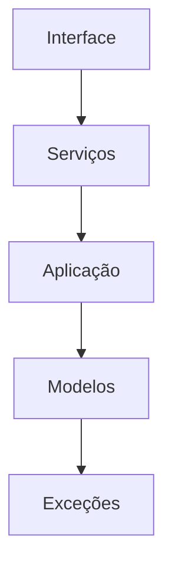
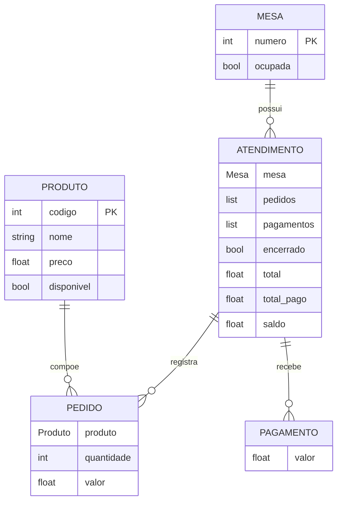

# 🍔 Registro de Comandas — Sabor da Orla

Sistema orientado a objetos desenvolvido para a lanchonete **Sabor da Orla**, com o objetivo de substituir o controle manual de comandas de papel por um sistema informatizado.

---

## 👥 Equipe

- Vitória Vale de Oliveira Da Silva
- Lucas Barbosa de Lima
- Larissa Beatriz Teixeira de Sousa

---

## 📌 Sobre o projeto

O sistema permite controlar as comandas da lanchonete desde a abertura do atendimento até o seu encerramento.

Durante um atendimento, é possível registrar os produtos consumidos, acompanhar o valor total da comanda, realizar pagamentos parciais, consultar o valor já pago e verificar o saldo restante.

Após a quitação da conta, o atendimento pode ser encerrado e a mesa volta a ficar disponível. Os atendimentos encerrados permanecem registrados para consulta do histórico.

Os dados são mantidos **em memória durante a execução do programa**.

---

## 🏗️ Arquitetura do projeto

```text
RegistroDeComandas/
│
├── main.py
├── aplicacao.py
├── lanchonete.py
│
├── servicos/
│   ├── mesa_service.py
│   ├── produto_service.py
│   ├── atendimento_service.py
│   ├── pedido_service.py
│   └── pagamento_service.py
│
├── modelos/
├── excecoes/
└── interface/
```



---

## 🔗 Diagrama ER



---

## ⚙️ Funcionalidades

### 🪑 Mesas
- Cadastrar mesas;
- Listar mesas;
- Consultar disponibilidade;
- Ocupar uma mesa ao abrir um atendimento;
- Liberar a mesa após o encerramento.

### 🍹 Produtos
- Cadastrar produtos;
- Listar produtos;
- Consultar produtos;
- Trabalhar com diferentes tipos de produtos utilizando herança e polimorfismo.

### 🧾 Atendimentos
- Abrir atendimento;
- Consultar uma comanda;
- Registrar pedidos;
- Consultar o consumo;
- Registrar pagamentos;
- Consultar pagamentos;
- Consultar o saldo;
- Encerrar atendimento;
- Consultar o histórico.

### 💳 Pagamentos
- Registrar pagamentos parciais;
- Consultar o total pago;
- Calcular o saldo restante;
- Impedir pagamentos superiores ao saldo da comanda.

---

## ⚠️ Regras de negócio

### Mesas
- Não é permitido abrir dois atendimentos simultaneamente para a mesma mesa.
- Uma mesa ocupada não pode receber um novo atendimento.

### Atendimentos
- Não é permitido registrar pedidos em um atendimento encerrado.
- Não é permitido registrar pagamentos em um atendimento encerrado.
- Não é permitido encerrar um atendimento com saldo pendente.
- Após o encerramento, a mesa volta a ficar disponível.
- O atendimento encerrado permanece no histórico.

### Pedidos
- A quantidade deve ser maior que zero.
- O pedido deve estar associado a um produto existente.

### Pagamentos
- O valor do pagamento deve ser maior que zero.
- Não é permitido realizar pagamento superior ao saldo da comanda.
- É possível realizar vários pagamentos parciais.

---

## ⚠️ Exceções personalizadas

O projeto possui uma hierarquia de exceções baseada em `LanchoneteError`.

```text
LanchoneteError
│
├── MesaOcupadaError
├── AtendimentoEncerradoError
├── AtendimentoNaoEncontradoError
├── ProdutoNaoEncontradoError
├── QuantidadeInvalidaError
├── PagamentoInvalidoError
└── AtendimentoNaoQuitadoError
```

As exceções são utilizadas para impedir operações que violem as regras de negócio do sistema.

---

## 🖥️ Interface

A interface textual foi organizada em menus e telas, seguindo a separação entre navegação e interação com as funcionalidades.

### Menus

```text
MenuPrincipal
│
├── MenuMesas
├── MenuProdutos
└── MenuAtendimentos
```

### Telas

```text
TelaMesas
TelaProdutos
TelaAtendimentos
```

---

## 🚀 Execução

Para iniciar a aplicação:

```bash
python main.py
```
