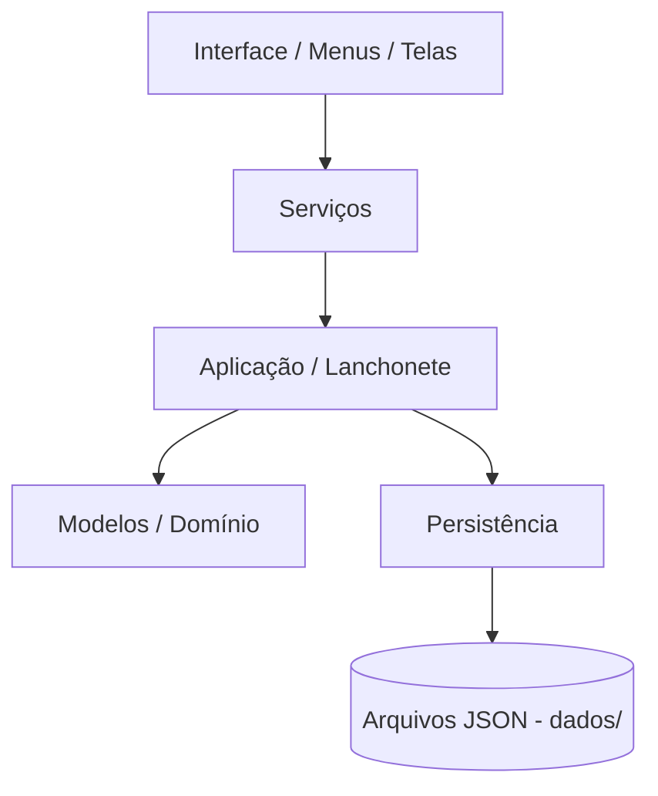
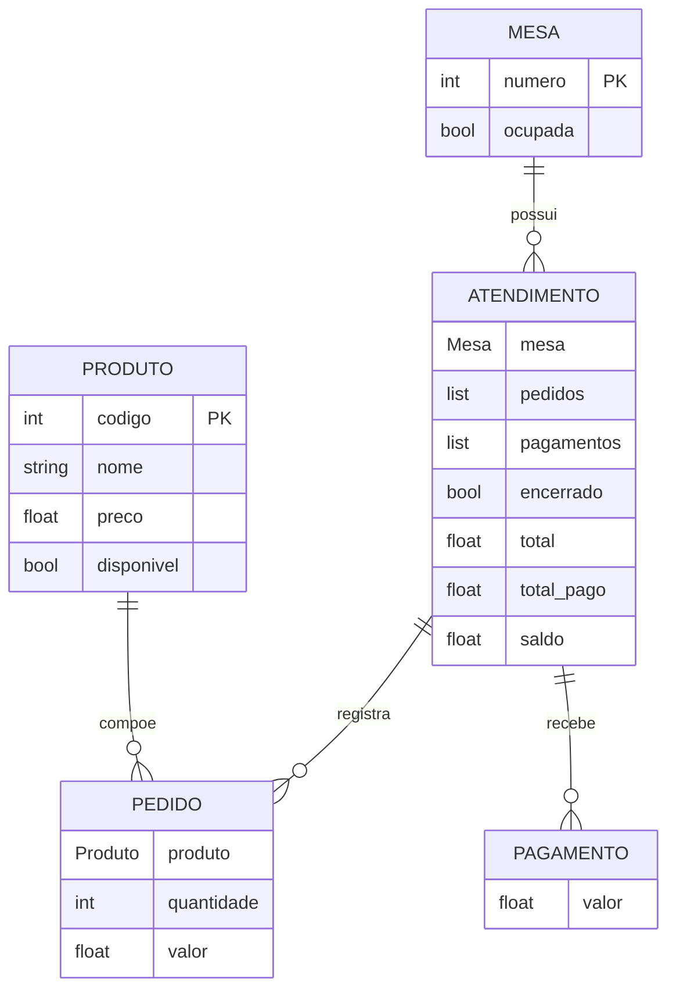

```markdown
# 🍔 Registro de Comandas — Sabor da Orla

Sistema orientado a objetos desenvolvido para a lanchonete **Sabor da Orla**, com o objetivo de substituir o controle manual de comandas de papel por um sistema informatizado.

---

## 👥 Equipe

- Vitória Vale de Oliveira Da Silva
- Lucas Barbosa de Lima
- Larissa Beatriz Teixeira de Sousa

---

## 📌 Sobre o projeto

O sistema permite controlar as comandas da lanchonete desde a abertura do atendimento até o seu encerramento.

Durante um atendimento, é possível registrar os produtos consumidos, acompanhar o valor total da comanda, realizar pagamentos parciais, consultar o valor já pago e verificar o saldo restante.

Após a quitação da conta, o atendimento pode ser encerrado e a mesa volta a ficar disponível. Os atendimentos encerrados permanecem registrados para consulta do histórico.

Os dados são **persistidos em arquivos JSON** na pasta `dados/`, garantindo que as informações cadastrais e o histórico de atendimentos permaneçam disponíveis mesmo após o encerramento do programa.

---

## 🏗️ Arquitetura do projeto

```text
RegistroDeComandas/
│
├── main.py
├── aplicacao.py
├── lanchonete.py
│
├── dados/
│   ├── atendimentos.json
│   ├── mesas.json
│   └── produtos.json
│
├── persistencia/
│   ├── __init__.py
│   ├── base_persistencia.py
│   ├── mesa_persistencia.py
│   ├── produto_persistencia.py
│   ├── atendimento_persistencia.py
│   ├── pedido_persistencia.py
│   └── pagamento_persistencia.py
│
├── servicos/
│   ├── mesa_service.py
│   ├── produto_service.py
│   ├── atendimento_service.py
│   ├── pedido_service.py
│   └── pagamento_service.py
│
├── modelos/
├── excecoes/
└── interface/

```


```mermaid
flowchart TD
    I[Interface / Menus / Telas] --> S[Serviços]
    S --> A[Aplicação / Lanchonete]
    A --> M[Modelos / Domínio]
    A --> P[Persistência]
    P --> J[(Arquivos JSON - dados/)]

```

---

## 🌿 Versionamento e Branches (Git)

O projeto seguiu uma evolução contínua documentada através das seguintes branches:

* **`versao-1`**: Primeira versão do projeto (regras de negócio e modelos mantidos em memória).
* **`versao-2`**: Arquitetura reorganizada com a introdução da camada de Serviços.
* **`versao-3`**: Terceira versão com a inclusão da camada de Persistência em arquivos JSON.
* **`main`**: Branch principal contendo a versão final e consolidada do projeto.

---

## 💾 Persistência de Dados (`dados/`)

A camada de persistência gerencia três arquivos JSON principais utilizando IDs relacionais:

* **`mesas.json`**: Guarda o número da mesa e o seu estado de ocupação.
* **`produtos.json`**: Armazena o código, nome e preço dos produtos.
* **`atendimentos.json`**: Registra os atendimentos vinculando os relacionamentos através do número da mesa e códigos dos produtos nos pedidos e pagamentos.

---

## 🔗 Diagrama ER


```mermaid
erDiagram
    MESA ||--o{ ATENDIMENTO : possui
    ATENDIMENTO ||--o{ PEDIDO : registra
    PRODUTO ||--o{ PEDIDO : compoe
    ATENDIMENTO ||--o{ PAGAMENTO : recebe

    MESA {
        int numero PK
        bool ocupada
    }

    ATENDIMENTO {
        Mesa mesa
        list pedidos
        list pagamentos
        bool encerrado
        float total
        float total_pago
        float saldo
    }

    PRODUTO {
        int codigo PK
        string nome
        float preco
        bool disponivel
    }

    PEDIDO {
        Produto produto
        int quantidade
        float valor
    }

    PAGAMENTO {
        float valor
    }

```

---

## ⚙️ Funcionalidades

### 🪑 Mesas

* Cadastrar mesas;
* Listar mesas;
* Consultar disponibilidade;
* Ocupar uma mesa ao abrir um atendimento;
* Liberar a mesa após o encerramento.

### 🍹 Produtos

* Cadastrar produtos;
* Listar produtos;
* Consultar produtos;
* Trabalhar com diferentes tipos de produtos utilizando herança e polimorfismo.

### 🧾 Atendimentos

* Abrir atendimento;
* Consultar uma comanda;
* Registrar pedidos;
* Consultar o consumo;
* Registrar pagamentos;
* Consultar pagamentos;
* Consultar o saldo;
* Encerrar atendimento;
* Consultar o histórico.

### 💳 Pagamentos

* Registrar pagamentos parciais;
* Consultar o total pago;
* Calcular o saldo restante;
* Impedir pagamentos superiores ao saldo da comanda.

---

## ⚠️ Regras de negócio

### Mesas

* Não é permitido abrir dois atendimentos simultaneamente para a mesma mesa.
* Uma mesa ocupada não pode receber um novo atendimento.

### Atendimentos

* Não é permitido registrar pedidos em um atendimento encerrado.
* Não é permitido registrar pagamentos em um atendimento encerrado.
* Não é permitido encerrar um atendimento com saldo pendente.
* Após o encerramento, a mesa volta a ficar disponível.
* O atendimento encerrado permanece no histórico.

### Pedidos

* A quantidade deve ser maior que zero.
* O pedido deve estar associado a um produto existente.

### Pagamentos

* O valor do pagamento deve ser maior que zero.
* Não é permitido realizar pagamento superior ao saldo da comanda.
* É possível realizar vários pagamentos parciais.

---

## ⚠️ Exceções personalizadas

O projeto possui uma hierarquia de exceções baseada em `LanchoneteError`.

```text
LanchoneteError
│
├── MesaOcupadaError
├── AtendimentoEncerradoError
├── AtendimentoNaoEncontradoError
├── ProdutoNaoEncontradoError
├── QuantidadeInvalidaError
├── PagamentoInvalidoError
├── AtendimentoNaoQuitadoError
└── RelacionamentoInvalidoError

```

As exceções são utilizadas para impedir operações que violem as regras de negócio do sistema ou inconsistências nos dados salvos.

---

## 🖥️ Interface

A interface textual foi organizada em menus e telas, seguindo a separação entre navegação e interação com as funcionalidades.

### Menus

```text
MenuPrincipal
│
├── MenuMesas
├── MenuProdutos
└── MenuAtendimentos

```

### Telas

```text
TelaMesas
TelaProdutos
TelaAtendimentos

```

---

## 🚀 Execução

Para iniciar a aplicação:

```bash
python main.py

```

```

```
